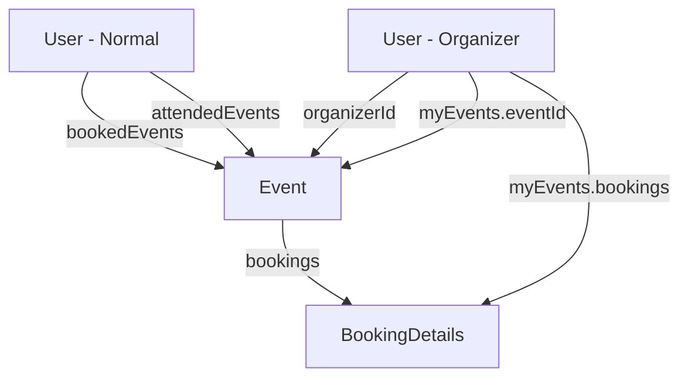

# EventHub Database Schema - Event & User Models

## 📋 Overview

This document explains the relationship between the Event and User models, and how booking-related schemas are shared between them to avoid duplication.

## 🏗️ Architecture

### Single Source of Truth

All event and booking-related schemas are defined in **`Event.ts`** and imported by **`User.ts`** to maintain consistency and avoid duplication.

```
Event.ts (Source)
├── IBookingDetails (interface)
├── BookingDetailsSchema (schema)
├── IOrganizerEvent (interface)
├── OrganizerEventSchema (schema)
└── IEvent (interface)

User.ts (Consumer)
└── Imports: IOrganizerEvent, OrganizerEventSchema
```

## 📦 Event Model (`models/Event.ts`)

### Exported Schemas & Interfaces

#### 1. **IBookingDetails** & **BookingDetailsSchema**

Stores information about individual bookings:

- `userId`: Reference to the User who booked
- `userName`: User's name (for quick access)
- `userEmail`: User's email (for contact)
- `seatsBooked`: Number of seats booked
- `bookedAt`: Timestamp of booking

**Used in:**

- Event model's `bookings` array
- User model's `myEvents.bookings` array

#### 2. **IOrganizerEvent** & **OrganizerEventSchema**

Stores event reference with booking tracking for organizers:

- `eventId`: Reference to Event document
- `bookings`: Array of IBookingDetails
- `totalSeatsBooked`: Quick count of total booked seats

**Used in:**

- User model's `myEvents` field (organizer-specific)

#### 3. **IEvent** (Main Event Interface)

Complete event document structure:

- Basic info: title, description, date, time, location, capacity, posterImage
- `organizerId`: Reference to User who created the event
- `bookings`: Array of all bookings for this event
- `availableSeats`: Calculated available capacity

## 👤 User Model (`models/User.ts`)

### Fields Using Event Schemas

#### Normal User Fields (All Users)

```typescript
bookedEvents: ObjectId[]        // References to Event documents
attendedEvents: ObjectId[]      // References to Event documents
```

#### Organizer-Specific Fields

```typescript
myEvents: IOrganizerEvent[]     // Imported from Event.ts
```

### Data Flow Example

**When a user books an event:**

1. Event document: Add booking to `event.bookings[]` (uses BookingDetailsSchema)
2. User document: Add event ID to `user.bookedEvents[]`
3. Organizer's document: Booking automatically appears in `organizer.myEvents[].bookings[]`

**When an event finishes:**

1. Move event ID from `user.bookedEvents[]` to `user.attendedEvents[]`
2. Event document remains unchanged (historical record)

## 🔄 Booking Lifecycle

### 1. User Books Event

```javascript
// Event document updated
event.bookings.push({
  userId: user._id,
  userName: user.name,
  userEmail: user.email,
  seatsBooked: 2,
  bookedAt: new Date(),
});

// User document updated
user.bookedEvents.push(event._id);

// Organizer's myEvents automatically reflects this
// (populated from Event.bookings)
```

### 2. Event Finishes (Date Passes)

```javascript
// Move from booked to attended
user.attendedEvents.push(eventId);
user.bookedEvents = user.bookedEvents.filter((id) => id !== eventId);
```

### 3. Organizer Views Bookings

```javascript
// Organizer can see all bookings for their events
organizer.myEvents.forEach((event) => {
  console.log(`Event: ${event.eventId}`);
  console.log(`Total Seats Booked: ${event.totalSeatsBooked}`);
  event.bookings.forEach((booking) => {
    console.log(`- ${booking.userName} (${booking.seatsBooked} seats)`);
  });
});
```

## 📊 Data Relationships



## 🎯 Benefits of This Structure

1. **No Duplication**: Booking schemas defined once in Event.ts
2. **Consistency**: Same structure used everywhere
3. **Maintainability**: Update in one place affects all uses
4. **Type Safety**: TypeScript interfaces ensure correctness
5. **Team Collaboration**: Clear separation of concerns
   - Auth team: User model (references only)
   - Events team: Event model (full implementation)

## 🔧 For Events Team

When implementing the Events module, you can:

1. **Extend IEvent** with additional fields
2. **Add validation** to EventSchema
3. **Create event management APIs** that update both Event and User documents
4. **Implement booking logic** that:
   - Checks `availableSeats`
   - Updates `event.bookings[]`
   - Updates `user.bookedEvents[]`
   - Updates `organizer.myEvents[]`

## 📝 Important Notes

- **Don't modify** BookingDetailsSchema or OrganizerEventSchema in User.ts
- **All booking-related changes** should be made in Event.ts
- **User.ts imports** these schemas to maintain consistency
- **TypeScript types** in `types/auth.ts` mirror these structures for frontend use

## ✅ Summary

This architecture ensures:

- ✅ Single source of truth for booking schemas
- ✅ No code duplication
- ✅ Easy maintenance and updates
- ✅ Clear team boundaries
- ✅ Type-safe implementation
